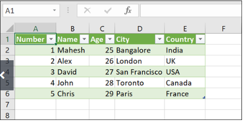

# Desafio

Para este projeto o desafio final envolve a entrega de uma API desenvolvida no framework Flask utilizando a Plataforma COLAB. O Objetivo principal está relacionado com a leitura de uma planilha de dados no formato JSON utilizando uma API no ambiente de desenvolvimento colaborativo COLAB.

 

Exemplo de planilha que deve ser feita a leitura:

 

 

Nosso servidor FastAPI deve trazer a planilha gerada em JSON, assim, como estamos apresentando um “Hello Word” neste exemplo. Para isso, deve ser dado um {Public_URL}/index no navegador para chegar ao nosso endpoint, pois criamos apenas uma rota, ou seja , /index.

[resolução](https://colab.research.google.com/drive/13cJ7Z5yA6MuBQ7HFQXBYq3Hjmu7VkiM1#scrollTo=UlTIw-zyFXoJ)